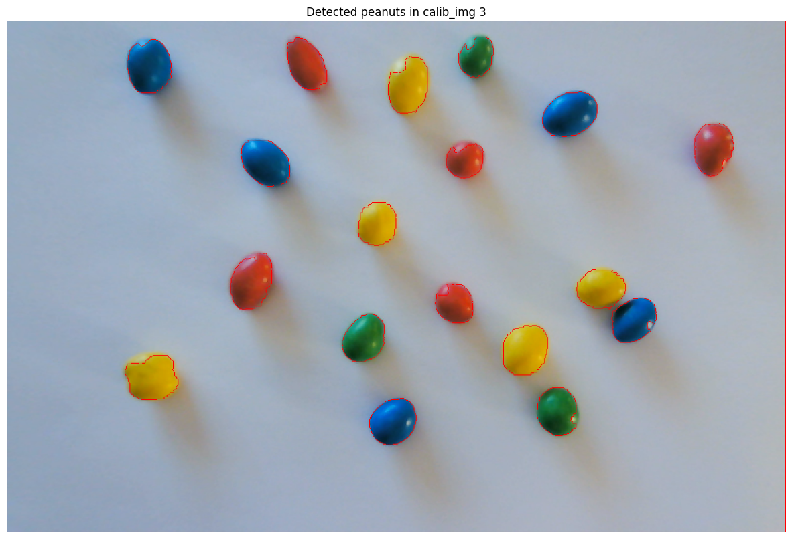
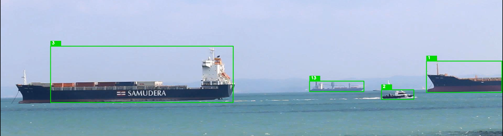

# CV FEUP

Repository for the work performed in the computer vision curricular unit of my master's degree.

## Assignment 1
The quality assurance tester of a M&M factory retrieves a sample from the production every hour to determine some properties of chocolate peanuts.
The factory uses a computer vision application to automatically calculate some properties of the sample, namely:
 - the distribution of each color in the sample, e.g., the number of red (or blue or …) chocolates. At the end, if the sample does not have chocolate peanuts of all colors, the system must raise an alarm by printing “Color XPTO is missing”.
 - the average shape area of all chocolate peanuts in millimeters and organized by color.

## Assignment 2
This project uses YOLOv8 and DeepSORT to perform "Multiple Vessel Detection and Tracking in Harsh Maritime Environments".
It aims to recreate the results of a paper released in early 2023 by researchers at INESC TEC.

---

First of all, run `pip install -r requirements.txt` to get all the required dependencies.
